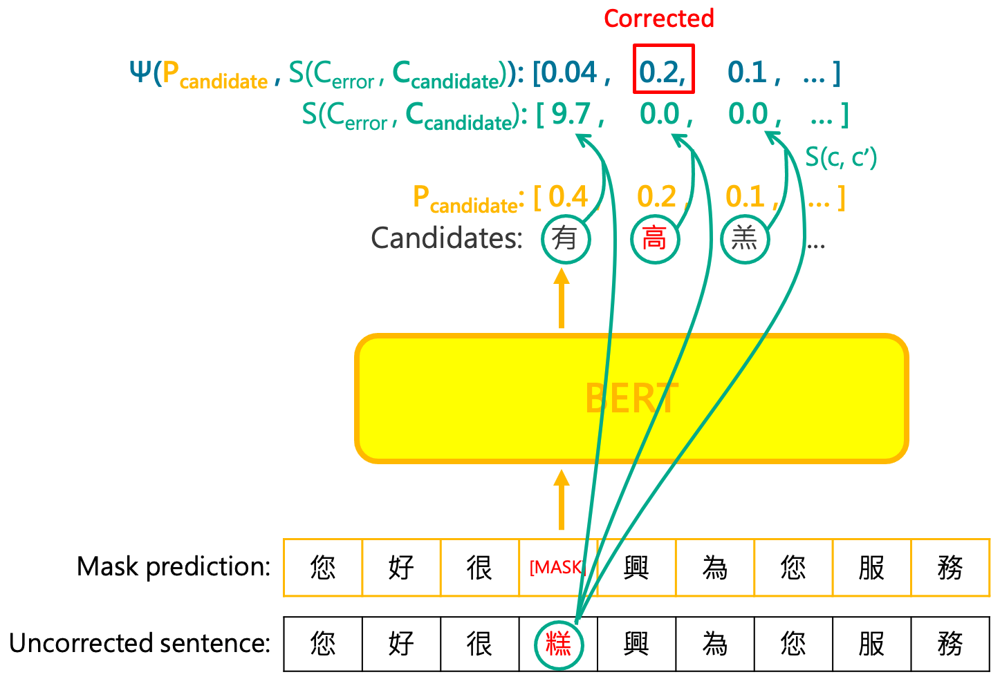

# Integrated Semantic and Phonetic Post-correction for Chinese Speech Recognition

| [paper](https://arxiv.org/abs/2111.08400) | [dataset](data/) | [pretrained detection model](https://storage.googleapis.com/esun-ai/bert_detection.zip) |

Authors: [Yi-Chang Chen](https://github.com/GitYCC), Chun-Yen Cheng, [Chien-An Chen](https://github.com/LukeCCA), Ming-Chieh Sung and Yi-Ren Yeh

Due to the recent advances of natural language processing, several works have applied the pre-trained masked language model (MLM) of BERT to the post-correction of speech recognition. However, existing pre-trained models only consider the semantic correction while the phonetic features of words is neglected. The semantic-only post-correction will consequently decrease the performance since homophonic errors are fairly common in Chinese ASR. In this paper, we proposed a novel approach to collectively exploit the contextualized representation and the phonetic information between the error and its replacing candidates to alleviate the error rate of Chinese ASR. Our experiment results on real world speech recognition datasets showed that our proposed method has evidently lower CER than the baseline model, which utilized a pre-trained BERT MLM as the corrector.



## Honors

Our paper won **the best paper** of ROCLING 2021.

## Getting Started

### Dependency

- This work was tested with PyTorch 1.7.0, CUDA 10.1, python 3.6 and Ubuntu 16.04.
- requirements : `requirements.txt`
```
pip install -r requirements.txt
```

### Download pretrained model

Download pretrained detection model on AISHELL3: https://storage.googleapis.com/esun-ai/bert_detection.zip

```
mkdir saved_models
cd saved_models
wget https://storage.googleapis.com/esun-ai/bert_detection.zip
unzip bert_detection.zip
cd ..
```

### Test Phonetic MLM

```
python src/test_phonetic_mlm.py \
  --config configs/config_phonetic_mlm.py \
  --json data/aishell3_test.json
```

### Inference Phonetic MLM

```
python src/predict_phonetic_mlm.py \
  --config configs/config_phonetic_mlm.py \
  --text_path misc/demo.txt
```

## Train Your Own Detection Model

### Train BERT detection model

```
python src/train_typo_detector.py \
  --config configs/config_detect.py
```

### Test BERT detection model

```
python src/test_typo_detector.py \
  --config configs/config_detect.py \
  --checkpoint saved_models/bert_detection/best_f1.pth \
  --json data/aishell3_test.json
```

### Inference BERT detection model

```
python src/predict_typo_detector.py \
  --config configs/config_detect.py \
  --checkpoint saved_models/bert_detection/best_f1.pth \
  --text_path misc/demo.txt
```

## Citation

Please consider citing this work in your publications if it helps your research.
```
@inproceedings{chen-etal-2021-integrated,
    title = "Integrated Semantic and Phonetic Post-correction for {C}hinese Speech Recognition",
    author = "Chen, Yi-Chang and Cheng, Chun-Yen and Chen, Chien-An and Sung, Ming-Chieh and Yeh, Yi-Ren",
    booktitle = "Proceedings of the 33rd Conference on Computational Linguistics and Speech Processing (ROCLING 2021)",
    month = oct,
    year = "2021",
    address = "Taoyuan, Taiwan",
    publisher = "The Association for Computational Linguistics and Chinese Language Processing (ACLCLP)",
    url = "https://aclanthology.org/2021.rocling-1.13",
    pages = "95--102",
    abstract = "Due to the recent advances of natural language processing, several works have applied the pre-trained masked language model (MLM) of BERT to the post-correction of speech recognition. However, existing pre-trained models only consider the semantic correction while the phonetic features of words is neglected. The semantic-only post-correction will consequently decrease the performance since homophonic errors are fairly common in Chinese ASR. In this paper, we proposed a novel approach to collectively exploit the contextualized representation and the phonetic information between the error and its replacing candidates to alleviate the error rate of Chinese ASR. Our experiment results on real world speech recognition datasets showed that our proposed method has evidently lower CER than the baseline model, which utilized a pre-trained BERT MLM as the corrector.",
}
```
